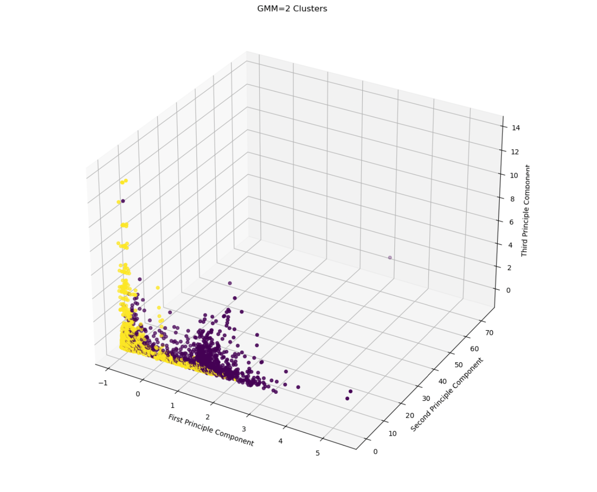

CS 4641 Team 5 Project (Test)

Summer 2023

Machine Learning for Credit Card Fraud Detection

# Midterm Checkpoint

 Kmeans

The data was cleaned with a k-nearest neighbors algorithm before being fitted to different
models and subjected to principle component analysis. Categorical features were one hot
encoded, and the dataset was downsampled to provide a balanced dataset. The data was
then sent through a series of tests in which an increasing number of principle components
were included. For each number of principle components considered, a k-means algorithm
was ran 10 times with various data measures collected. The average results of the clustering
evaluations was graphed and analyzed above. Over the various tests, the k-means algorithm
had an average balanced accuracy of 0.59 and an average F-Measure of 0.32. These results
show that the linear boundaries of k-means did not give a good reprisentation of the highly
nonlinear data. The convergence to high error results implies that k-means is not capable of
adequately modeling the data.

## GMM
The data was prepared identically to k-means, and a similar battery of tests were ran with
increasing numbers of principle components included. For the sake of rigor and
completeness, a gaussian mixture of 2 components and 4 components were both tested. In
a round of preliminary testing, the average log likelihoods of gaussian mixture models with
various numbers of components were collected, and 4 clusters was identified as the best
performer via the elbow method. The binary gaussian mixture had an average balanced
accuracy of 0.67, and an average F-Measure of 0.56. The 4-component mixture had an
average balanced accuracy of 0.56, and an average F-Measure of 0.24. Overall, the
gaussian models did not show a sufficient improvement over k-means. Their convergences
to high error results imply they the gaussian mixture model is not capable of adequately
modeling the data.

!

!

## DBSCAN
Our group's implementation of DBCAN involved using the same preprocessing pipeline used with the rest of the implementations. However, we did not use PCA to reduce the dimensionality of the data to two axes because we knew that DBCAN only works well with two dimensions or less. We used TSNE instead, which has shown to be an improvement over PCA in numerous cases and we thought it fit our case. Due to the computationally intensive nature of DBSCAN, we decided to use the GPU-accelerated version of SKLEARN, CUML, on colab. This allowed us to run the many perplexities and iterations of TSNE that are needed to evaluate, which perplexity we should use for DBSCAN as well as whether our number of iterations was enough to reach stability for TSNE. We ran all perplexity values, the hyperparameter for TSNE, from 5 to 50, which are the recommended values, for 10 thousand iterations. Then we ran that set of perplexities again for 20 thousand iterations, which is far above the default value of 1 thousand for TNSE. We did this because when we were running with the default number of iterations we were not reaching stability as a lot of the perplexities had pinching. Even with 20 thousand iterations, still weren't getting much obvious clustering, so we decided to choose the best-looking group with no pinching and looked like it was separating into 2 groups, perplexity 46, since we would run out of compute time if we tried running all perplexities for more iterations. We ran a perplexity of 46 for 100 thousand iterations and then ran GPU-accelerated DBSCAN on the dimensionally reduced dataset with eps ranging from 200 to 1000 with a min sampling size of 2, 3, or 4. This provided 5 to 6 clusters separated a lot, but also missing a lot of data points. I then decided to use the data provided by running TNSE with a perplexity of 50 with 20 thousand iterations as it provided a relatively tight group and was relatively stable between 10 thousand and 20 thousand iterations. This still yielded 5 to 6 clusters. It is clear with DBSCAN that it is not suited well to data of this dimensionality especially with a limited amount of available compute time as we did not get two clusters one with fraud and one with good transactions. DBSCAN provided many clusters instead of two despite the many parameters we tested with TSNE and DBSCAN, so it did not lend itself well to further analysis.
### TNSE Analysis
All perplexities from 5 to 50 with 20 thousand iterations

Perplexity 46 with 100000 iterations

### DBSCAN Analysis
DBSCAN of data of perplexity 46 with 100 thousand iterations

DBSCAN of data of perplexity 50 with 20 thousand iterations

## Naive Bayes
The Naive Bayes Classifier is our first supervised technique and only supervised classifier for the midterm checkpoint. With the Naive Bayes (Gaussian) classifier, it is especially interesting to look at how an imbalance in the training set will affect the algorithm, as the priors are calculated immediately from the data itself. I will run the algorithm at multiple ratios of MajoritySet:MinoritySet (legitimate transactions and fraudulent transactions respectively) to see how this affects the various evaluation scores of the model.

The plots here indicate that the model rapidly begins to overfit as the dataset becomes unbalanced. The F1 score, which measures the harmonic mean of precision and recall, indicates that the model becomes increasingly skewed towards labeling all data as legitimate, which could indicate especially that the Bayesian Priors are having a significant effect on the fitting of the model.

This is somewhat surprising to us, as we suspected that there would be some benefit to the skewed Priors for unbalanced data. This relationship was not supported by the performance of the model.

As F1 score is particularly useful for measuring the performance of a classifier with imbalanced data, this should be considered far more heavily than the accuracy, which likely indicates that the model is rapidly overfitting.

Fixing this ratio at 1, we test the performance of our model on the test set, which was cleaned separately.

Even with a balance between the two class labels in the training set, the F1 score of the data on the test set is low. It is possible that simply more data is required to improve the performance of the Naive Bayesian Classifier. As such, we might explore upsampling techniques in the future to balance the data while providing more samples. This, like many things, is difficult in high dimensions, our current FAMD approach to data representation should help with this matter.  

# Midterm Report

Credit card fraud detection is a valuable application of ML that has been researched extensively over the past decade [1]. The goal of researchers has been to use anonymized data supplied by credit card companies to train models that determine if a credit card transaction is fraudulent, generally as a binary classification [2]. A major goal is to allow for accurate real-time detection of credit card fraud that can prevent the unlawful purchases as they happen and notify the holder of the card of fraudulent activity [3]. Prior research has resulted in comparative analyses of various machine learning methods on the problem, as well as discussions about the main difficulties in designing an accurate classifier with the data supplied [2]. 

Despite the interest that has been taken in fraud detection, the problem of credit card fraud has gotten progressively more severe in the 2010s and early 2020s, with a projected $397 billion loss over the 2020s worldwide [1, 4]. This is in part due to the dynamic nature of the problem: as fraud detection improves, so too do fraudsters who often attempt to mimic the normal purchases of the card’s holder [2]. Around 65% of the total losses are covered by the credit companies, while the remaining 35% is left to the merchants to fill [4]. Improving the performance of models is a constant necessity.

We plan to use a combination of supervised and unsupervised learning for this. Supervised classifiers like Naive Bayes classification and SVMs can be used to provide confident classifications for an input as fraudulent or legitimate, while clustering methods are capable of clustering data into a cluster of legitimate purchases and one or more illegitimate purchases. Intuitively, we will start with hard clustering such as K-means and hierarchical techniques, as this is a binary classification, but we will also explore the use of soft boundaries: card holders can make unusual purchases, so it is important to determine whether a purchase is actually fraudulent or simply unusual. We handled this case with a Gaussian Mixture Model, where we could identify unusual purchases as somewhere between fraudulent and legitimate. We intend to use sk-learn implementations for these algorithms, although if we move to neural networks in the final for better performance, we may make changes to the architecture for better results. Finally, one of the biggest issues with the problem is the imbalance of data: since there are far more legitimate purchases than fraudulent ones, there is a need for some approach to balance the training data for the model. We PCA, factor analysis, downsampling, and k-nearest neighbors to clean the data.

Link to our semester plan: https://docs.google.com/spreadsheets/d/1Jp_Bu6QtXSaUK9Z2fSecP_BQxmAvKgUN0jklrbbOljo/edit?usp=sharing

Link to our dataset: https://www.kaggle.com/competitions/ieee-fraud-detection/data

Responsibilities:

Sam: Assist with data cleaning, sampling, and feature reduction. Implementation, testing, and visualization of DBSCAN, Midterm Report

William: Assist with data cleaning, sampling, and feature reduction. Implementation, testing, and visualization of Hierarchical Clustering and SVM, Proposal and Github management

Stefan: Assist with data cleaning, sampling, and feature reduction. Implementation, testing, and visualization of Neural Networks and Naive Bayes

Carter: Primary for data cleaning, sampling, and feature reduction. Implementation, testing, and visualization of Regressions

Keyes: Assist with data cleaning, sampling, and feature reduction. Implementation, testing, and visualization of K-Means and GMM, Midterm Report

All: Results comparison and final report, peer reviews.

Bibliography

1. “Credit Card Fraud Detection: Everything You Need To Know.” Credit Card Fraud Detection: Everything You Need to Know, 13 May 2023, www.inscribe.ai/fraud-detection/credit-fraud-detection.

2. Awoyemi, John O., et al. Credit Card Fraud Detection Using Machine Learning... - IEEE Xplore, ieeexplore.ieee.org/stamp/stamp.jsp?arnumber=8123782. Accessed 17 June 2023. 

3. Thennakoon, Anuruddha, et al. Real-Time Credit Card Fraud Detection Using Machine Learning - IEEE..., 2019, ieeexplore.ieee.org/document/8776942. 

4. Egan, John. “Credit Card Fraud Statistics.” Bankrate, 12 Jan. 2023, www.bankrate.com/finance/credit-cards/credit-card-fraud-statistics/#fraud.

