CS 4641 Team 5 Project

Summer 2023

Machine Learning for Credit Card Fraud Detection

# Midterm Report

## Intro
Credit card fraud detection is a valuable application of ML that has been researched extensively over the past decade [1]. The goal of researchers has been to use anonymized data supplied by credit card companies to train models that determine if a credit card transaction is fraudulent, generally as a binary classification [2]. A major goal is to allow for accurate real-time detection of credit card fraud that can prevent the unlawful purchases as they happen and notify the holder of the card of fraudulent activity [3]. Prior research has resulted in comparative analyses of various machine learning methods on the problem, as well as discussions about the main difficulties in designing an accurate classifier with the data supplied [2]. 

Despite the interest that has been taken in fraud detection, the problem of credit card fraud has gotten progressively more severe in the 2010s and early 2020s, with a projected $397 billion loss over the 2020s worldwide [1, 4]. This is in part due to the dynamic nature of the problem: as fraud detection improves, so too do fraudsters who often attempt to mimic the normal purchases of the card’s holder [2]. Around 65% of the total losses are covered by the credit companies, while the remaining 35% is left to the merchants to fill [4]. Improving the performance of models is a constant necessity.

## Problem Definition
We used a combination of supervised and unsupervised learning for this. Supervised classifiers like Naive Bayes classification and SVMs can be used to provide confident classifications for an input as fraudulent or legitimate, while clustering methods are capable of clustering data into a cluster of legitimate purchases and one or more illegitimate purchases. Intuitively, we have started with hard clustering such as K-means and hierarchical techniques, as this is a binary classification, but we also explored the use of soft boundaries: card holders can make unusual purchases, so it is important to determine whether a purchase is actually fraudulent or simply unusual. We handled this case with a Gaussian Mixture Model, where we could identify unusual purchases as somewhere between fraudulent and legitimate. We intend to use sk-learn implementations for these algorithms, although if we move to neural networks in the final for better performance, we may make changes to the architecture for better results. 

Finally, one of the biggest issues with the problem is the imbalance of data: since there are far more legitimate purchases than fraudulent ones, there is a need for some approach to balance the training data for the model. To identify which transaction features were most important, we used principle component analysis and factor analysis. To address the problem of too few occurances of fraud, we downsampled the dataset. The dataset often listed features that were never collected, so we used k-nearest neighbors to deal with discrepencies. Below is a more thorough description of the data's problems and our solutions.

## Data cleaning
 **WRITE A CLEAR DESCRIPTION OF THE DATASET, THE PROBLEMS WITH IT, AND THE CLEANING APPROACH/METHODS HERE**\
 What is the dataset, how was the data collected, how did we decide to clean it, what methods did we try but decide to not use?

The data we used was taken from a competition for fraud detectionn hosted by Vesta, a company which works in that field. The data we used contains information about individual transactions which take place. Each transaction has an ID and label, after which it contains many features numerical and categorical features such as the amount, product code (for product in the transaction), card, address, time, and some features engineered by Vesta. The specific meaning of most of the values is often masked.

We cleaned this method in 2 ways.

//Insert William's method description

Additionally, we also cleaned the dataset using a similar method with a kNN model we wrote ourselves which capped the number of samples compared from the complete dataset rather than splitting the data into buckets before cleaning. This is expected to have little impact on features which were more complete & had lessing missing data, but may produce better results for filling in missing data for features that were missing a majority of the data. We ran this kNN method with k = 25 and a maximum complete sample size (sampled randomly from the complete samples) of 2500.

## Methodology
### Kmeans
The Kmeans algorithm clusters the data based on each point's distance to the cluster center. Because of this, the boundaries produced by kmeans are simple and based only on Euclidean distance. The data was cleaned with a k-nearest neighbors algorithm before being fitted to different
models and subjected to principal component analysis. Categorical features were one hot
encoded, and the dataset was downsampled to provide a balanced dataset. After this preparation, the slices of the dataset
were sent through a total of 15 kmeans clusterings. Each test used more features than the previous one, with the 15th test fitting the entire dataset. To prevent randomness and noise from polluting the results, each of the 15 tests were repeated 10 times, with the average results collected and graphed in the results section.
### GMM
GMM clusters the data by fitting a specified number of multivariate gaussian distributions to the dataset. Each point is then assigned a probability of being a member of one of the gaussian distributions. For the sake of visualization and comparison with other methods, each point was given a hard assignment to its most likely distribution.\ 
The data was prepared identically to k-means, and a similar battery of tests were ran with
increasing numbers of principle components included. 15 tests using increasing numbers of features were ran, and each test
was ran ten times to minimize the effects of random starting conditions. For the sake of rigor and
completeness, a gaussian mixture of 2 components and 4 components were both tested. In
a round of preliminary testing, the average log likelihoods of gaussian mixture models with
various numbers of components were collected, and 4 clusters was identified as the best
performer via the elbow method.\
### DBSCAN
DBSCAN Methodology here:\\
### Naive Bayes
NB Methodology here:\\
## Results and Discussion
After cleaning the data, the three highest variance features were identified via Principle Component Analysis. The graph below graphs the data points as a function of those components. The yellow points are fraudulent cases.

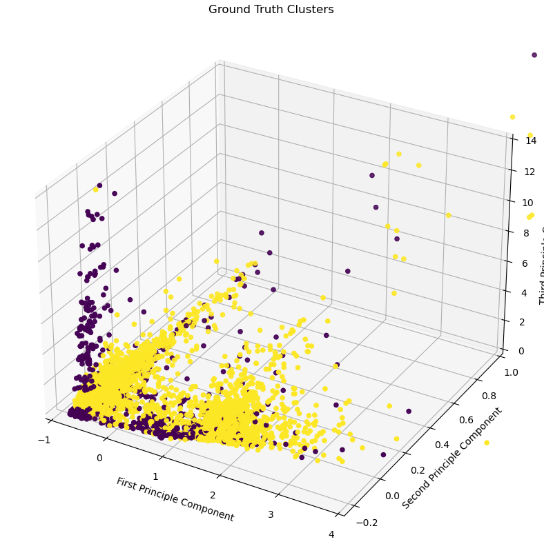
### Kmeans

Over the numerous tests, the k-means algorithm
had an average balanced accuracy of 0.59 and an average F-Measure of 0.32. These results
show that the simple boundaries of k-means did not give a good representation of the highly
nonlinear data. The model's convergence to high error results implies that k-means is not capable of
adequately modeling the data.\
Below is the average Rand Statistic of the kmeans clustering with varying fractions of the features concerned. The horizontal axis shows what portion of the features were considered, starting with one fifteenth of the data and ending with the whole dataset. The Rand Statistic is similar to normal accuracy, so it is not very reliable for unbalanced datasets. However, the downsampling solves this problem. The result of about 0.6 shows that the clusters were mostly identifying true negative cases, which is not very useful in commercial applications. The repetition of each test ten times was effective in getting rid of noise due to random initialization, but the inclusion of more features was unable to make the model improve its Rand Statistic.

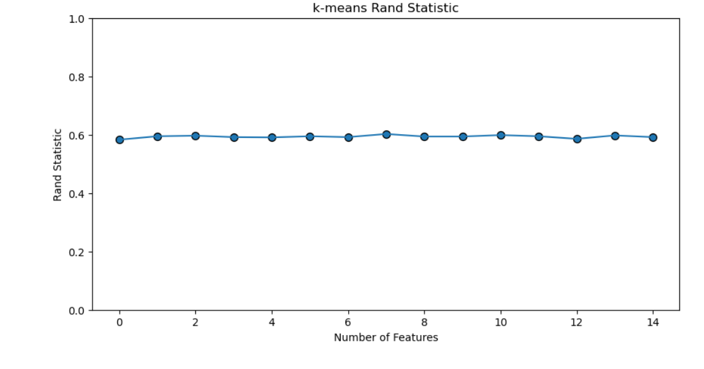

These graphs show the performance of kmeans as measured with precision, recall, f-measure, and balanced accuracy. The results for precision seem impressive, but f-measure is a more informative metric because it accounts for the model's precision and Recall. Similarly, balanced accuracy is more informative than regular accuracy. These results show that the model's performance was mostly invariant as more features were added. The lack of convergence is troubling because the model is getting stable results, but poor ones. For instance, the balanced accuracy never went above 60.11%.

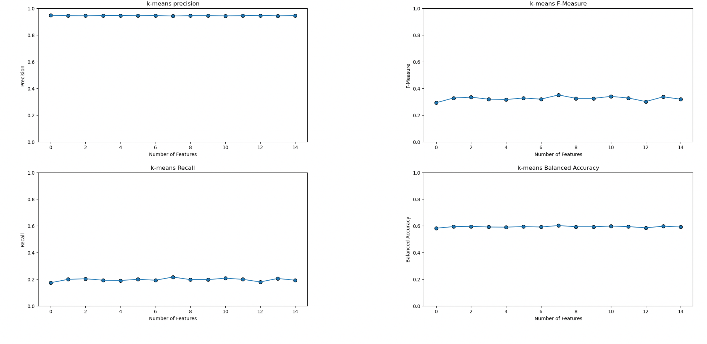
The Jaccard Coefficient ignores the contribution of true negative results, so the dismally low values show that a large portion of the accuracy found above was due to the model correctly identifying cases of legitimate transactions. In the case of real world applications, there is less value in identifying true legitimate cases than true fraudulent cases because it may only take one fraudulent user to steal large sums of money. With this real-world factor in consideration, the average Jaccard Coefficient of 0.19 proves that kmeans is functionally useless for real-world applications.
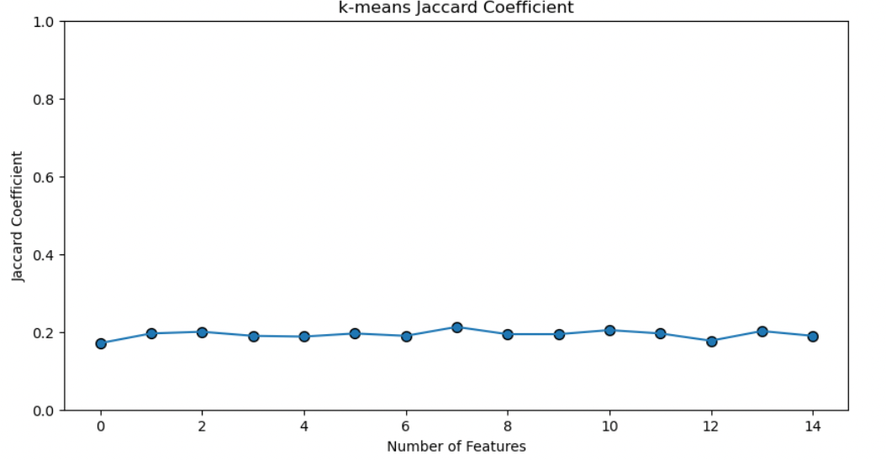
The graph below plots the ground truth clustering on the left, and the kmeans clustering on the right. The unimpressive overlap of the two graphs illustrates the point made by the pairwise measures. 

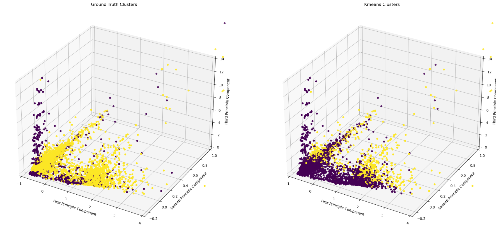

### GMM
The binary gaussian mixture had an average balanced
accuracy of 0.67 and an average F-Measure of 0.56. The 4-component mixture had an
average balanced accuracy of 0.56, and an average F-Measure of 0.24. Overall, the
gaussian models did not show a sufficient improvement over k-means. Their convergences
to high error results imply they the gaussian mixture model is not capable of adequately
modeling the data.\
Below is the average Rand Statistic of the kmeans clustering with varying fractions of the features concerned. The horizontal axis shows what portion of the features were considered, starting with $\frac{1}{15}$ and ending with $\frac{15}{15}$. The rand statistic shows that, even with the help of lots of false negatives to boost its score, the accuracy of the model is quite poor. GMM gives soft assignments, so the pairwise metrics were evaluated based on the most likely assignment for the sake of consistent comparison with kmeans clustering.

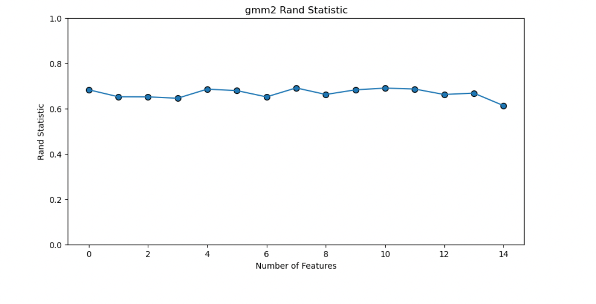

GMM had a similar trend as kmeans in that its precision was somewhat high, but the low recall drove down its f-measure, so taken together this model is not a very useful predictor. Balanced accuracy showed a similar trend of stable, poor results.

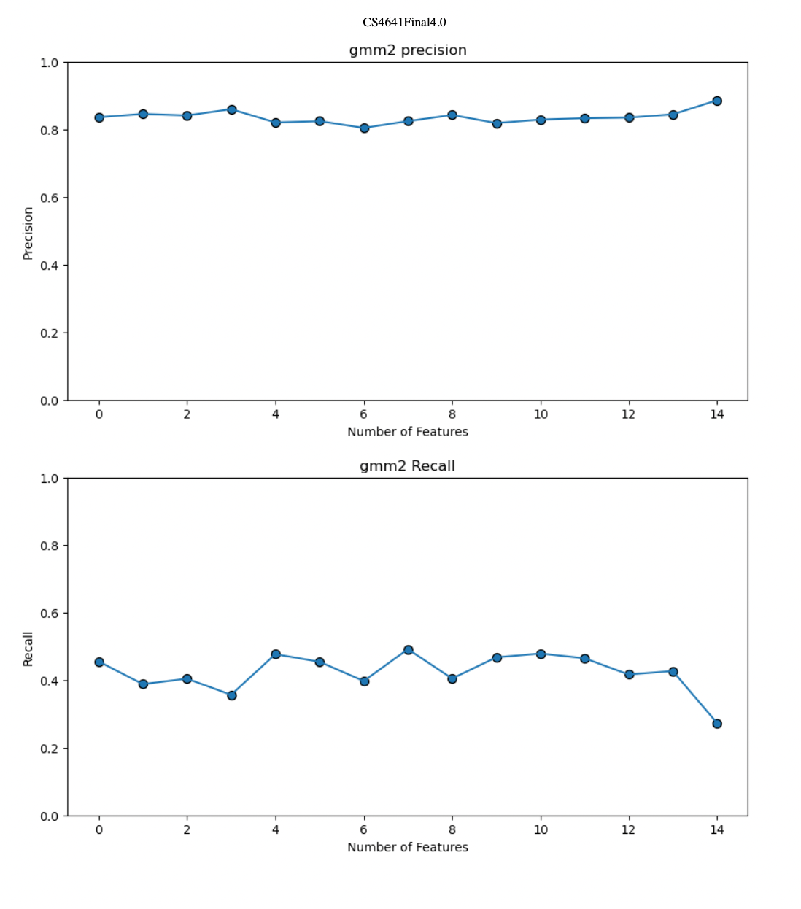

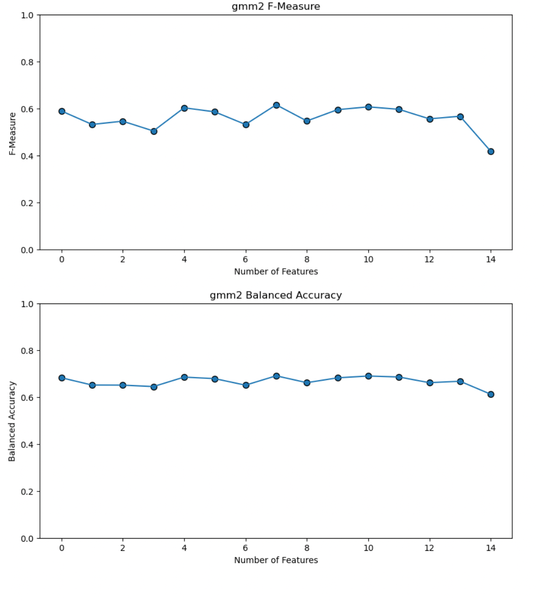

The jaccard coefficient for GMM was better than that of kmeans, but it still had a dismal average result of 0.44, which is still far below what would be needed for any real-world application.

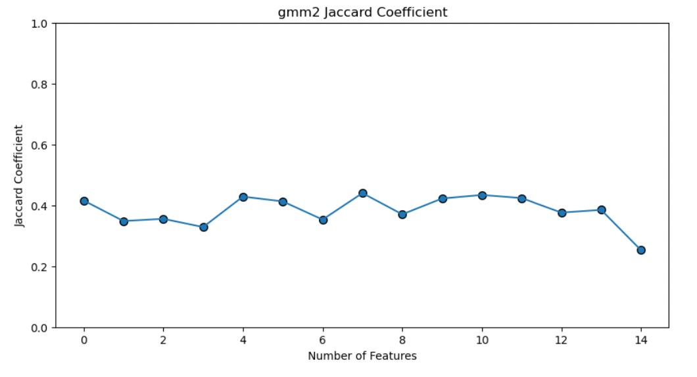

The graph below plots the ground truth clusters on the left and the predicted clusters on the right. Even though the graph only shows the top three principal components, the poor correspondence of this graph to the ground truth one shows that this clustering lacks much predictive power.

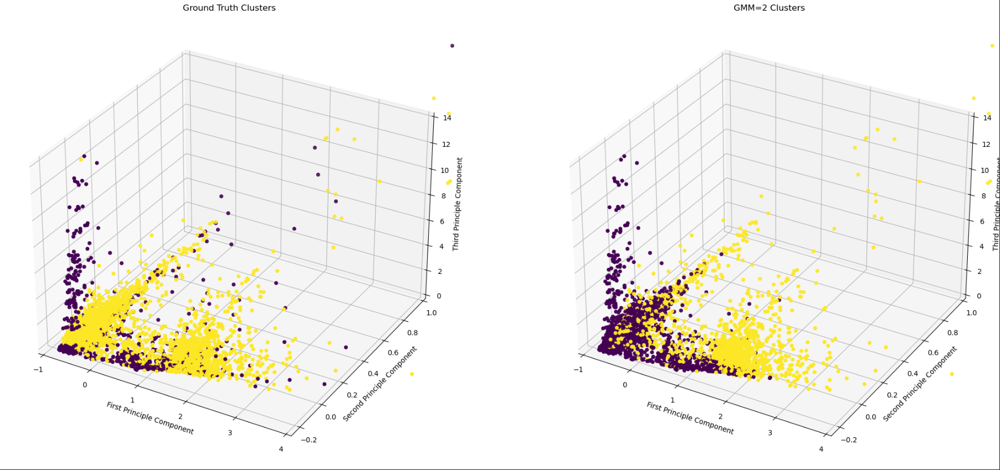

Although the task of identifying fraud is a binary clustering problem, the poor results above show that the previous models were too simple to represent the data. Before addressing this problem with more complex models, it is worth examining a more complex Gaussian Mixture Model with four clusterings instead of two. In this case, the cluster with the highest proportion of fraud cases is taken to be the fraud cluster, and the other clusters are treated as legitimate.\
However, adding more clusters did not help the performance in rand statistic. The smaller clustering had virtually no effect, and the results are almost identical to the binary clustering case.

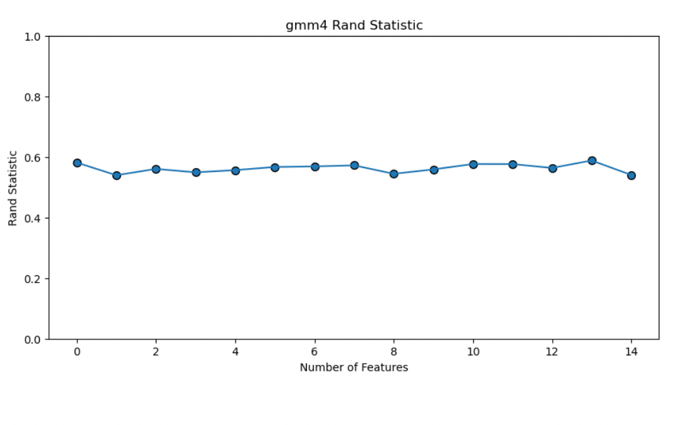

The additional clusters only exacerbated the existing behaviors of the binary case. The precision results were higher due to the smaller clustering, but the corresponding fall in recall left the f-measure result with an average of 0.24. The balanced accuracy showed no meaningful change either.

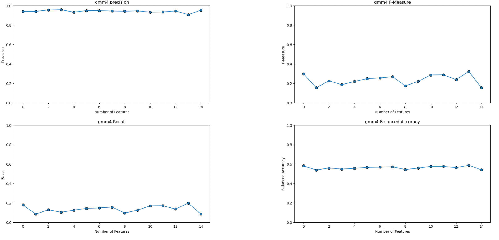

The true weakness in the 4-cluster model is shown by the Jaccard Coefficient. Adding two additional clusters made the resulting clusters smaller than their binary counterparts, which increased the number of false negatives in the data. These false negatives propped up the balanced accuracy shown above. By neglecting these additional false negatives, this model shows the worst performance so far, with an average jaccard coefficient of 0.13. The previous models were too simple to represent the data well, but the added complexity will not come from simply adding more clusters.

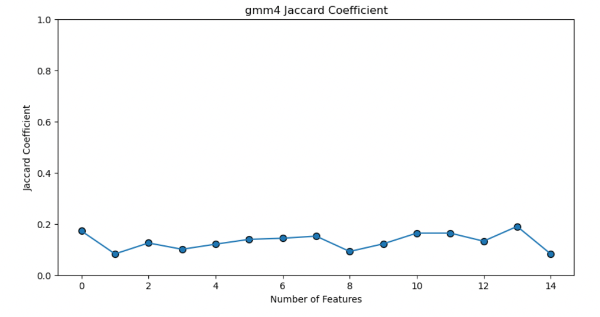

Here is the clustering of the 4-gaussian mixture. The colors represent the highest likelihood assignment of each point. The first image shows all resulting clusters, and the second image isolates the fraud cluster.

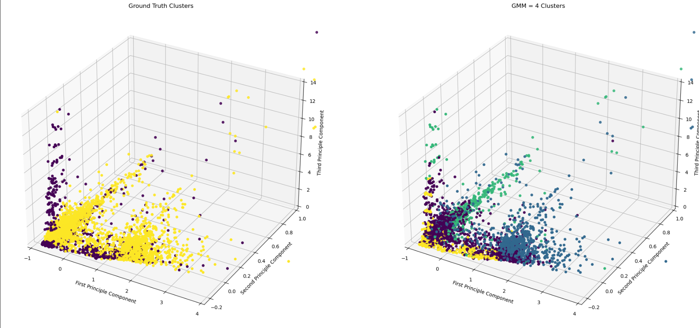
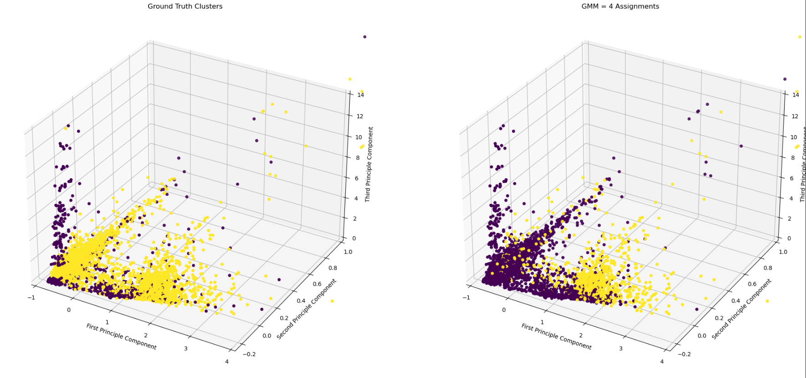

Overall, the gaussian mixture model was unsuccessful at producing anything that would be useful in a real-world application. We make one final attempt at an unsupervised fraud detection method before moving on to the more powerful supervised methods. 

### DBSCAN
Our group's implementation of DBCAN involved using the same preprocessing pipeline used with the rest of the implementations. However, we did not use PCA to reduce the dimensionality of the data to two axes because we knew that DBCAN only works well with two dimensions or less. We used TSNE instead, which has shown to be an improvement over PCA in numerous cases and we thought it fit our case. Due to the computationally intensive nature of DBSCAN, we decided to use the GPU-accelerated version of SKLEARN, CUML, on colab. This allowed us to run the many perplexities and iterations of TSNE that are needed to evaluate, which perplexity we should use for DBSCAN as well as whether our number of iterations was enough to reach stability for TSNE. We ran all perplexity values, the hyperparameter for TSNE, from 5 to 50, which are the recommended values, for 10 thousand iterations. Then we ran that set of perplexities again for 20 thousand iterations, which is far above the default value of 1 thousand for TNSE. We did this because when we were running with the default number of iterations we were not reaching stability as a lot of the perplexities had pinching. Even with 20 thousand iterations, still weren't getting much obvious clustering, so we decided to choose the best-looking group with no pinching and looked like it was separating into 2 groups, perplexity 46, since we would run out of compute time if we tried running all perplexities for more iterations. We ran a perplexity of 46 for 100 thousand iterations and then ran GPU-accelerated DBSCAN on the dimensionally reduced dataset with eps ranging from 200 to 1000 with a min sampling size of 2, 3, or 4. This provided 5 to 6 clusters separated a lot, but also missing a lot of data points. I then decided to use the data provided by running TNSE with a perplexity of 50 with 20 thousand iterations as it provided a relatively tight group and was relatively stable between 10 thousand and 20 thousand iterations. This still yielded 5 to 6 clusters. It is clear with DBSCAN that it is not suited well to data of this dimensionality especially with a limited amount of available compute time as we did not get two clusters one with fraud and one with good transactions. DBSCAN provided many clusters instead of two despite the many parameters we tested with TSNE and DBSCAN, so it did not lend itself well to further analysis.
#### TNSE Analysis
All perplexities from 5 to 50 with 20 thousand iterations

Perplexity 46 with 100000 iterations
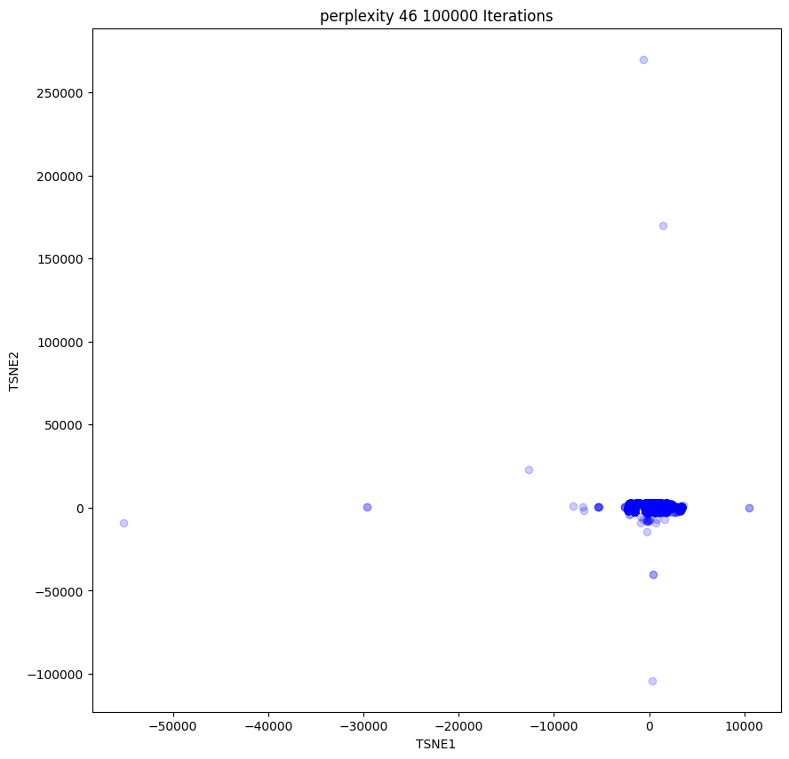

### DBSCAN Analysis
DBSCAN of data of perplexity 46 with 100 thousand iterations
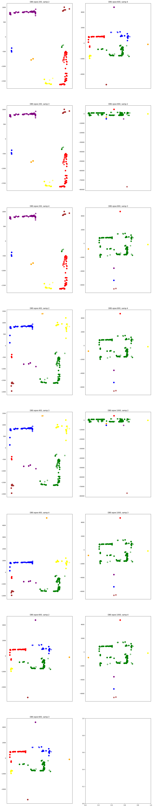

DBSCAN of data of perplexity 50 with 20 thousand iterations
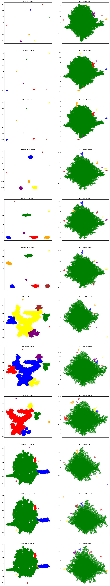

### Naive Bayes
The Naive Bayes Classifier is our first supervised technique and only supervised classifier for the midterm checkpoint. With the Naive Bayes (Gaussian) classifier, it is especially interesting to look at how an imbalance in the training set will affect the algorithm, as the priors are calculated immediately from the data itself. I will run the algorithm at multiple ratios of MajoritySet:MinoritySet (legitimate transactions and fraudulent transactions respectively) to see how this affects the various evaluation scores of the model.

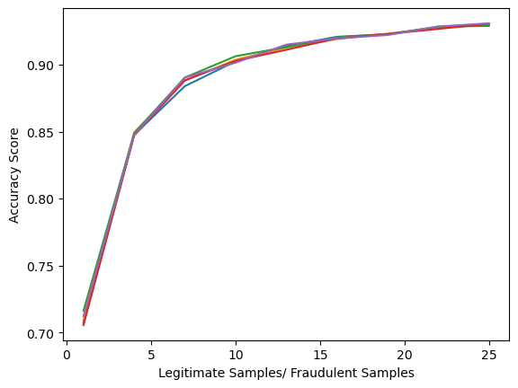

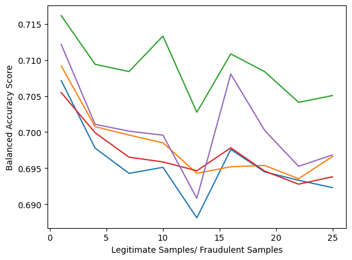

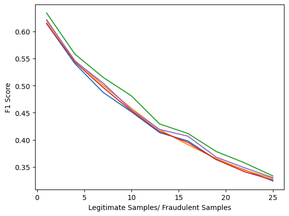

The plots here indicate that the model rapidly begins to overfit as the dataset becomes unbalanced. The F1 score, which measures the harmonic mean of precision and recall, indicates that the model becomes increasingly skewed towards labeling all data as legitimate, which could indicate especially that the Bayesian Priors are having a significant effect on the fitting of the model.

This is somewhat surprising to us, as we suspected that there would be some benefit to the skewed Priors for unbalanced data. This relationship was not supported by the performance of the model.

As F1 score is particularly useful for measuring the performance of a classifier with imbalanced data, this should be considered far more heavily than the accuracy, which likely indicates that the model is rapidly overfitting.

Fixing this ratio at 1, we test the performance of our model on the test set, which was cleaned separately.

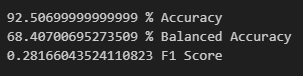

Even with a balance between the two class labels in the training set, the F1 score of the data on the test set is low. It is possible that simply more data is required to improve the performance of the Naive Bayesian Classifier. As such, we might explore upsampling techniques in the future to balance the data while providing more samples. This, like many things, is difficult in high dimensions, our current FAMD approach to data representation should help with this matter.  

Link to our semester plan: https://docs.google.com/spreadsheets/d/1Jp_Bu6QtXSaUK9Z2fSecP_BQxmAvKgUN0jklrbbOljo/edit?usp=sharing

Link to our dataset: https://www.kaggle.com/competitions/ieee-fraud-detection/data

Responsibilities:

Sam: Assist with data cleaning, sampling, and feature reduction. Implementation, testing, and visualization of DBSCAN, Midterm Report

William: Assist with data cleaning, sampling, and feature reduction. Implementation, testing, and visualization of Hierarchical Clustering and SVM, Proposal and Github management

Stefan: Assist with data cleaning, sampling, and feature reduction. Implementation, testing, and visualization of Neural Networks and Naive Bayes

Carter: Primary for data cleaning, sampling, and feature reduction. Implementation, testing, and visualization of Regressions

Keyes: Assist with data cleaning, sampling, and feature reduction. Implementation, testing, and visualization of K-Means and GMM, Midterm Report

All: Results comparison and final report, peer reviews.

Bibliography

1. “Credit Card Fraud Detection: Everything You Need To Know.” Credit Card Fraud Detection: Everything You Need to Know, 13 May 2023, www.inscribe.ai/fraud-detection/credit-fraud-detection.

2. Awoyemi, John O., et al. Credit Card Fraud Detection Using Machine Learning... - IEEE Xplore, ieeexplore.ieee.org/stamp/stamp.jsp?arnumber=8123782. Accessed 17 June 2023. 

3. Thennakoon, Anuruddha, et al. Real-Time Credit Card Fraud Detection Using Machine Learning - IEEE..., 2019, ieeexplore.ieee.org/document/8776942. 

4. Egan, John. “Credit Card Fraud Statistics.” Bankrate, 12 Jan. 2023, www.bankrate.com/finance/credit-cards/credit-card-fraud-statistics/#fraud.

